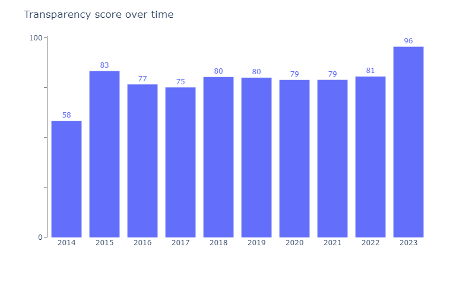

# Data For Good - EU Tax Observatory Data Visualizations 

## Data For Good
 
Data For Good is a 1901 association created in 2014 that brings together a community of 4000+ tech volunteers (Data Scientists, Data Analysts, Data Engineers, Developers, UX/UI Designers, Product & Project Owners) wishing to put their skills to work for associations, NGOs, and the SSE - and to commit themselves to the general interest.

Each year, Data For Good organizes acceleration seasons during which a dozen or so projects are supported by volunteers on social, societal and environmental themes.

## EU Tax Observatory - Country by country tax reporting
 
The EU Tax Observatory is one of season 12's projects, which aims to compile data on the location of multinationals' profits, in order to gain a better understanding of tax evasion and aggressive tax optimization. One of the project's goals is to make this data accessible and understandable to everyone with a website where the data can be downloaded, viewed and explored interactively.

## Data Visualizations
The [`taxobservatory-dataviz`](#https://github.com/anquetos/data4good-taxobservatory-dataviz/blob/449876a6805aae48b1948f356d1000f26434bc6e/taxobservatory-dataviz.ipynb) notebook contains the code to compute and display 10 of the necessary Dataviz needed in the website.

### Tools used
* Python
* Pandas
* Plotly

### Example : Viz 27 - average transparency score over time
 
